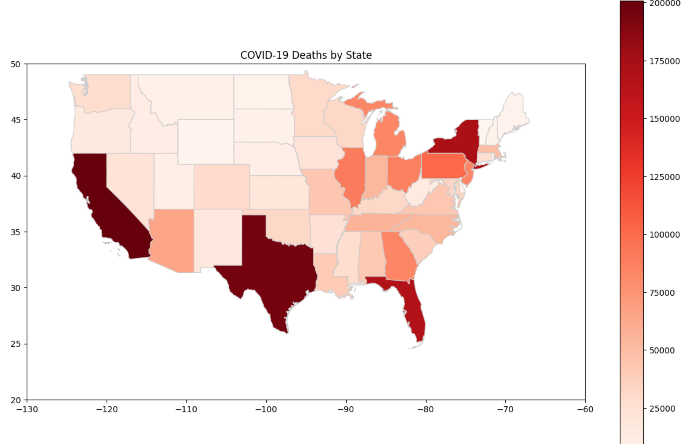

# Analyzing COVID-19 🦠 Impact Across USA States: Diagnostics, Hospitalization, and Mortality data
The COVID-19 pandemic has left an indelible mark on global health, economy, and society, underscoring the urgent need for vigilant monitoring and comprehension of key metrics such as diagnostic, hospitalization and mortality rates. As the threat of pandemics or similar health crises persists, the ability to monitor these metrics becomes increasingly crucial for effective public health responses.In this project, primary aim is to analyze COVID-19 testing data, hospitalization rates, and mortality rates across different states within the United States. We aim to provide insights on testing, infection rates, and the burden on healthcare systems by closely examining these measures at the state level.The analysis of COVID-19 data unveils High numbers of positive cases, particularly evident in states like California, Texas, and Florida, New York underscore the significant spread of the virus within these regions. Moreover, the data highlights the strain on healthcare systems, with populous states such as California and Texas reporting elevated levels of hospitalizations. Perhaps most sobering is the observation of substantial COVID-19 mortality rates, notably prevalent in densely populated states like California, Texas, and Florida. Delving deeper into the distribution of deaths among ethnic groups reveals disparities in healthcare outcomes, with Non-Hispanic White populations generally experiencing higher mortality rates across most states. However, Hispanic or Latino populations also exhibit significant mortality rates, particularly notable in states such as California and Texas, underscoring the importance of addressing healthcare access disparities. The bubble chart analysis further reinforces these findings, illustrating a positive correlation between total population and COVID-19 deaths, emphasizing the heightened susceptibility of densely populated areas to the virus's spread. Overall, these insights shed light on the multifaceted challenges posed by the pandemic and underscore the urgent need for targeted interventions to mitigate its impact, particularly in vulnerable communities.

